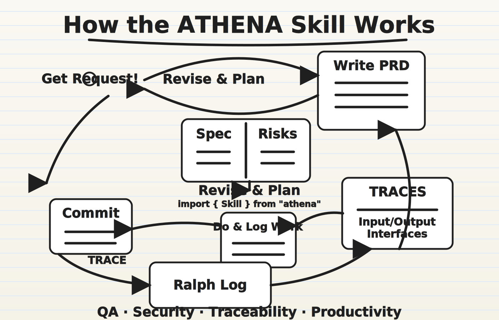
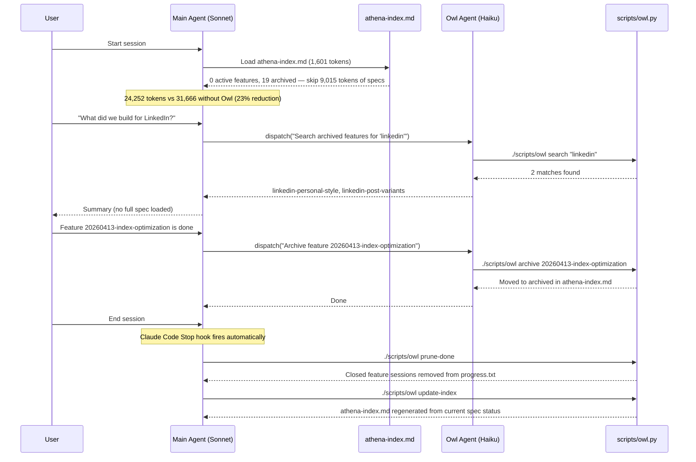
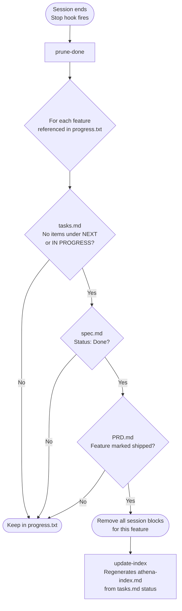
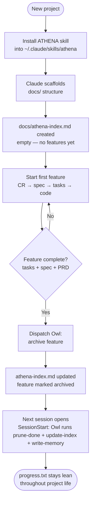

# ATHENA Framework



ATHENA is an agent-agnostic delivery framework for PRD-driven, traceable software execution.

## What ATHENA Does

ATHENA creates a **complete audit trail from customer request to shipped code**:

- **Captures customer requests verbatim** in `docs/requests.md` (CR-... IDs)
- **Documents design decisions** in `docs/decisions.md` (D-... IDs)
- **Maintains a living PRD** in `docs/PRD.md` with full traceability
- **Specs features** in `docs/specs/<FEATURE_ID>/spec.md` with functional requirements (FR-...)
- **Lists tasks** in `docs/specs/<FEATURE_ID>/tasks.md` linked to requirements (Implements: FR-...)
- **Tracks execution** in `docs/progress.txt` with validation evidence
- **Creates traceable Git commits** referencing CR/D/FEATURE_ID/T-... IDs
- **Enables auditing** via `docs/TRACEABILITY.md` to follow any request through to code

## Owl of Athena (Claude Code)

Owl is a Claude Code sub-agent that runs alongside ATHENA sessions. It handles archive operations and keeps `progress.txt` lean — so the main agent spends tokens on active work, not history.

**What Owl does:**
- Serves as the archive interface: search, retrieve, and summarize closed features on demand
- Runs `prune-done` at session end to remove fully-closed feature sessions from `progress.txt`
- Regenerates `athena-index.md` so the main agent loads only active specs at startup

**Token impact** (measured on this project using cl100k_base tokenizer, 19 features):

| File | Tokens | Loaded with Owl? |
|---|---|---|
| `docs/decisions.md` | 7,250 | Yes |
| `docs/PRD.md` | 7,002 | Yes |
| All 19 `spec.md` files | 9,015 | **No — replaced by athena-index.md** |
| `docs/progress.txt` | 4,412 | Yes (shrinks as features close) |
| `docs/requests.md` | 3,807 | Yes |
| `docs/athena-index.md` | 1,601 | Yes |
| `docs/TRACEABILITY.md` | 180 | Yes |
| **Total without Owl** | **31,666** | |
| **Total with Owl** | **24,252** | |
| **Savings** | **7,414 (23%)** | |

The spec savings are real and grow with the project — every additional closed feature adds ~470 tokens to the spec load that Owl skips. The larger opportunity is `decisions.md` and `progress.txt`, which grow unboundedly without pruning. `prune-done` targets `progress.txt` at session end; `decisions.md` and `PRD.md` are append-only by design.

### How a Session Works



### When the Main Agent Dispatches to Owl

The main agent uses the Agent tool to delegate — it does not load archived specs directly.

| Situation | Dispatch prompt |
|---|---|
| User asks about a closed feature | `"Retrieve summary for <feature-id>"` |
| User searches history | `"Search archived features for '<keyword>'"` |
| Feature is fully done (tasks + spec + PRD) | `"Archive feature <feature-id>"` |
| athena-index.md is out of sync | `"Run update-index"` |

### How Owl Determines a Feature is Fully Closed

Owl checks all three in sequence. All must pass before any session history is pruned.



**Why three checks:** `tasks.md` is ground truth for task completion. `spec.md` confirms the feature was formally closed. `PRD.md` confirms the requirement was shipped — not just done in isolation. All three must agree before history is pruned.

### progress.txt: What Changes

`progress.txt` accumulates normally across sessions for active features. Nothing about how you use it changes. Owl prunes it automatically at session end — only removing sessions for features that are fully closed across all three files.

| State | progress.txt behavior |
|---|---|
| Feature active | Accumulates across sessions as normal |
| Feature done in tasks.md only | Kept — spec and PRD not reconciled yet |
| Feature done in all three | Removed at next session end |
| Pruned history | Not archived — it lives in tasks.md (DONE section) |

---

## Upgrading Existing ATHENA Projects

If your project was already using ATHENA before this update, follow these steps once after pulling the changes. These instructions apply to the `feature/index-based-archival` branch and later.

```mermaid
flowchart LR
    A([Existing project\nno athena-index.md]) --> B[Pull branch /\nupdate SKILL.md]
    B --> C["Run:\n./scripts/owl update-index"]
    C --> D[athena-index.md created\nfrom existing specs]
    D --> E["Run:\n./scripts/install-hooks.sh"]
    E --> F[Git hooks installed\npre-commit + post-commit]
    F --> G["Optional:\n./scripts/owl prune-done"]
    G --> H[Closed feature sessions\nremoved from progress.txt]
    H --> I([Running normally\nOwl fires on session end])
```



**Fast path — paste this prompt into Claude Code:**

```
Upgrade Owl of Athena in this project. Run ./scripts/owl update-index to generate docs/athena-index.md, run ./scripts/install-hooks.sh to install git hooks, run ./scripts/owl prune-done to clean progress.txt, then commit the results.
```

**Manual path:**

1. Pull this branch or merge to your main branch.
2. Run `./scripts/owl update-index` once. This reads your existing `docs/specs/` and generates `docs/athena-index.md`. It checks `tasks.md` first for status — if a feature has no items under NEXT or IN PROGRESS, it marks it Done.
3. Run `./scripts/install-hooks.sh` to install the pre-commit and post-commit hooks.
4. Optionally run `./scripts/owl prune-done` to immediately clean closed feature sessions from `progress.txt`. Skip this if you want to review `progress.txt` manually first.
5. Commit `docs/athena-index.md` and the updated `progress.txt` to your repo.

After step 5, Owl runs automatically at session start (Haiku agent via `SessionStart` hook) and at session end (shell via `Stop` hook). You do not need to call it manually. If you have not yet done the global hook setup, follow **Step 2** in the Installation section.

**What does not change:** `docs/requests.md`, `docs/decisions.md`, `docs/PRD.md`, and all existing spec files are untouched. The traceability audit trail is preserved exactly as-is.

---

## New Projects Starting with ATHENA

New projects get Owl automatically — no migration step needed.



**Key difference from existing projects:** You start with an empty `athena-index.md`. As you complete features, Owl archives them incrementally. `progress.txt` never accumulates the years of history that existing projects have — it stays bounded from day one.

---

## Installation

There are two things to install: the **ATHENA skill** (the loop instructions Claude follows) and **Owl of Athena** (the Claude Code agent and hooks that manage your archive). Install both for the full experience.

### Step 1 — Install the ATHENA Skill

**Claude Code:**

In an active Claude Code session, paste this prompt:

```
Install the athena skill from https://github.com/taylorparsons/athena-skill — copy the entire skills/athena/ directory into ~/.claude/skills/athena/
```

Claude will write `~/.claude/skills/athena/` including `SKILL.md`, `templates/`, `scripts/`, and `core/`.

**Verify:** `~/.claude/skills/athena/SKILL.md` exists, or run `/skills` to confirm `athena` is listed.

**Codex:**

```bash
$skill-installer https://github.com/taylorparsons/athena-skill/
```

---

### Step 2 — Install Owl of Athena (Claude Code only)

Owl requires three things: the agent file, the global hooks, and the git hooks on each project.

#### 2a. Copy the agent file

```bash
mkdir -p ~/.claude/agents
cp .claude/agents/owl-of-athena.md ~/.claude/agents/owl-of-athena.md
```

This makes Owl available as a sub-agent in every Claude Code session.

#### 2b. Add hooks to `~/.claude/settings.json`

Open `~/.claude/settings.json` and merge in the `hooks` block below. If you already have a `hooks` key, add `SessionStart` and `Stop` into the existing object — do not replace the whole file.

```json
{
  "hooks": {
    "SessionStart": [
      {
        "matcher": "",
        "hooks": [
          {
            "type": "command",
            "command": "REPO_ROOT=$(git rev-parse --show-toplevel 2>/dev/null) && [ -f \"$REPO_ROOT/scripts/owl\" ] && cd \"$REPO_ROOT\" && ./scripts/owl prune-done && ./scripts/owl update-index && ./scripts/owl write-memory; true"
          }
        ]
      }
    ],
    "Stop": [
      {
        "matcher": "",
        "hooks": [
          {
            "type": "command",
            "command": "REPO_ROOT=$(git rev-parse --show-toplevel 2>/dev/null) && [ -f \"$REPO_ROOT/scripts/owl\" ] && cd \"$REPO_ROOT\" && ./scripts/owl prune-done && ./scripts/owl update-index; true"
          }
        ]
      }
    ]
  }
}
```

Both hooks are conditional — they check for `scripts/owl` before running and are safe to install globally. They only activate in repos where Owl is present.

**`scripts/owl` requirement:** Each ATHENA project must have a `scripts/owl` script. This script handles:
- `prune-done` — removes closed feature sessions from `progress.txt`
- `update-index` — regenerates `athena-index.md` from current spec status
- `write-memory` — extracts active docs (decisions, requests, progress) into memory files for single-session read (new in Apr 2026)

If the script is missing, copy it from an existing ATHENA project or use the fast-path prompt below to scaffold it.

> **Already installed?** If you set up Owl before April 2026, your `SessionStart` hook may use the old `type: "agent"` format which is not supported and will cause a hook error on session start. Run the patch script to fix it:
> ```bash
> python3 scripts/patch-claude-settings.py
> ```

**What each hook does:**

| Hook | When | What |
|---|---|---|
| `SessionStart` | Project opens | Shell command runs `prune-done` + `update-index` + `write-memory` before Athena loads |
| `Stop` | Session ends | Same cleanup as a belt-and-suspenders pass |

#### 2d. Add Owl to `~/.claude/CLAUDE.md`

If you have a `~/.claude/CLAUDE.md` with an Available Skills section, add the following entry after the `athena` entry. This scopes Owl to mid-session dispatches — the `SessionStart` hook handles the pre-session run automatically.

```markdown
### owl-of-athena
**Path:** `.claude/agents/owl-of-athena.md` (sub-agent, dispatched via Agent tool)
**Trigger:** Dispatch mid-session when: a feature is fully done (archive it), the user asks about archived features, or athena-index.md appears stale. Never load archived specs directly — use Owl. Note: `prune-done`, `update-index`, and `write-memory` run automatically via the `SessionStart` shell hook before Athena loads — do not dispatch Owl for these at session start.
```

> **Already installed?** The patch script handles both `settings.json` and `CLAUDE.md` in one pass:
> ```bash
> python3 scripts/patch-claude-settings.py
> ```

#### 2c. Install git hooks on each ATHENA project

Run this once per project, from the project root:

```bash
./scripts/install-hooks.sh
```

This installs:
- `pre-commit` — blocks commits if `athena-index.md` is out of sync with `docs/specs/`
- `post-commit` — regenerates `athena-index.md` when a commit signals feature completion

---

### Step 3 — Bootstrap an existing project (first time only)

If your project already has ATHENA docs but no `athena-index.md`, you have two options:

**Fast path — paste this prompt into Claude Code:**

```
Bootstrap Owl of Athena in this project. Run ./scripts/owl update-index to generate docs/athena-index.md, run ./scripts/install-hooks.sh to install git hooks, run ./scripts/owl prune-done to clean progress.txt, then commit the results.
```

**Manual path:**

```bash
python3 scripts/owl.py update-index
git add docs/athena-index.md && git commit -m "feat: add athena-index.md for Owl of Athena"
```

New projects get `athena-index.md` automatically when Claude scaffolds the docs structure.

---

### Option C: Bootstrap ATHENA docs in a new project

To set up the full ATHENA docs structure in an existing project (`docs/requests.md`, `docs/decisions.md`, `docs/PRD.md`, `docs/specs/`, `docs/athena-index.md`, etc.), open Claude Code in that project and paste:

```
Setup ATHENA docs in this project from https://github.com/taylorparsons/athena-skill
```

Claude will create the full scaffold including `athena-index.md`. Then run `./scripts/install-hooks.sh` to activate the git hooks.

## Install Target

- `skills/athena/`: canonical full `athena` skill for Codex/Claude Code
- Contains exactly one `SKILL.md` with required frontmatter (`name`, `description`)

## Quick Start (5 minutes)

1. **Review the framework**: Read `core/athena-framework.md` (10-step ATHENA loop)
2. **Understand the structure**: Check `docs/TRACEABILITY.md` (audit trail entry point)
3. **Add your first request**: Edit `docs/requests.md`, add a CR-... entry with your requirement
4. **Create a feature spec**: Copy template from `templates/spec.md` to `docs/specs/<FEATURE_ID>/spec.md`
5. **Make decisions**: Add to `docs/decisions.md` if you need to interpret the request
6. **Start executing**: Create `docs/specs/<FEATURE_ID>/tasks.md` from template and tackle one task at a time

## Repository Layout

- `skills/athena/`: installable `athena` package
- `core/athena-framework.md`: canonical, agent-neutral ATHENA loop
- `adapters/`: framework adapter source materials
- `templates/`: traceability templates
- `scripts/`: helper automation (`commit_with_traceability.py`, `bootstrap_git_audit.py`, `print_resume_prompt.py`)
- `VERSION`: source-of-truth framework version (SemVer)
- `docs/`: this repo's own ATHENA artifacts and examples (walkthrough examples in `docs/examples/`)

## Key Files & What They Do

| File | Purpose |
|------|---------|
| `core/athena-framework.md` | Complete ATHENA methodology and 10-step loop |
| `docs/TRACEABILITY.md` | Entry point: navigate from request to code |
| `docs/requests.md` | Customer inputs (append-only log) |
| `docs/decisions.md` | Design decisions (append-only log) |
| `docs/PRD.md` | Living requirements document |
| `docs/specs/*/spec.md` | Feature specifications with acceptance criteria |
| `docs/specs/*/tasks.md` | Implementation tasks (Implements: FR-...) |
| `docs/progress.txt` | Active execution log — closed feature sessions pruned automatically by Owl |
| `docs/athena-index.md` | Lightweight feature index (~1,100 tokens) — agents load this instead of all specs |
| `.claude/agents/owl-of-athena.md` | Owl sub-agent definition (Claude Code) — copy to `~/.claude/agents/` |
| `.claude/settings.json` | SessionStart + Stop hooks — Haiku agent runs before Athena loads, shell cleanup on exit |
| `scripts/owl.py` | Owl operations: archive, retrieve, search, update-index, prune-done |
| `scripts/install-hooks.sh` | Installs pre-commit and post-commit git hooks |
| `templates/` | Ready-to-use templates for specs, tasks, requests, decisions, progress |
| `scripts/` | Helper utilities (`commit_with_traceability.py`, `bootstrap_git_audit.py`, etc.) |
| `adapters/claude/` | Claude-specific guidance (`COMMANDS.md`, `CLAUDE_PROMPT.md`) |
| `adapters/codex/` | Codex skill adapter |

## Non-Negotiable Rules

1. **Capture verbatim**: Record customer requests exactly as stated before changing anything.
2. **Append-only logs**: Never delete or edit `docs/requests.md` or `docs/decisions.md` entries.
3. **Full traceability**: Link sources (CR/D) to requirements (FR) to tasks (T).
4. **Single focus**: Only one task `IN PROGRESS` at a time.
5. **Evidence required**: Every task needs test/check results.
6. **Git integration**: Commit messages reference CR/D/FEATURE_ID/T-... IDs.
7. **Never auto-push**: Only push to remote when explicitly requested.

## Validation

Run install-target validation locally:

```bash
python3 scripts/validate_install_targets.py
```

This checks:
- each declared install target exists,
- each target has exactly one `SKILL.md`,
- frontmatter includes required `name` and `description`.

## Versioning

- Version source of truth: `VERSION`
- Scheme: Semantic Versioning (`MAJOR.MINOR.PATCH`)
- Git tag format: `v<MAJOR>.<MINOR>.<PATCH>`

## Help & Resources

- **Examples**: `docs/examples/01-cr-to-task-walkthrough.md` (step-by-step example)
- **Claude Adapter**: `adapters/claude/CLAUDE_PROMPT.md` and `adapters/claude/COMMANDS.md`
- **Codex Skill**: `adapters/codex/SKILL.md` (Codex skill definition)

## Publishing

- GitHub as source of truth (tags/releases)
- LinkedIn for launch/adoption examples
- `publishing/launch-checklist.md`
